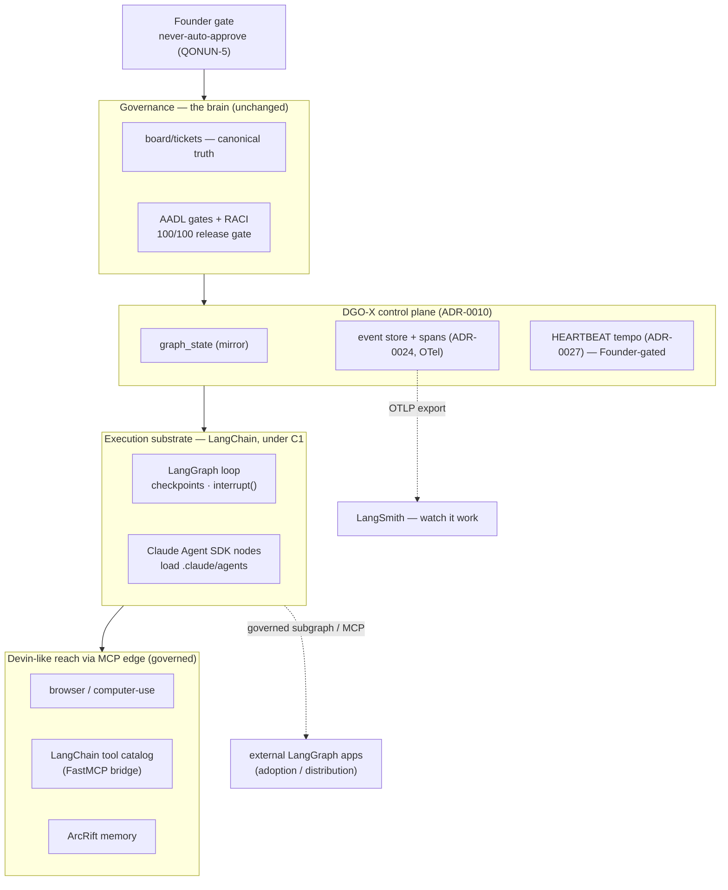

# DasLab → "Governed Devin": operating like an autonomous software engineer via the LangChain ecosystem

- **Type:** Direction brief (research / program input — precedes the ADRs it recommends)
- **Date:** 2026-07-22
- **Status:** Draft for Founder review — no code, no dispatch change; recommends ADRs 0033–0036
- **Scope:** Platform / org-engine — target capability direction and the LangChain-ecosystem interop contract
- **North star (Founder):** *"DasLab huddi devin.ai kabi ishlasin"* — DasLab should operate like Devin: an autonomous software engineer you hand a goal and it plans, builds, tests, and ships with minimal human input.
- **Relates:** [ADR-0010 DGO-X](../adr/0010-adopt-dgox-graph-orchestrated-control-plane.md) · [ADR-0023 run-model](../adr/0023-run-model.md) · [ADR-0024 span-events](../adr/0024-span-event-schema.md) · [ADR-0027 scheduler-safety / HEARTBEAT](../adr/0027-scheduler-safety.md) · [ADR-0005 worktree-per-ticket](../adr/0005-worktree-per-ticket-dispatch-ownership.md) · [ADR-0009 harness-owns-transport](../adr/0009-harness-owns-transport-admission-layer.md) · [ADR-0012 event redaction](../adr/0012-dgox-event-store-content-classification-redaction-policy.md)

---

## 0 — One-paragraph answer

"Work like Devin" is, for DasLab, **less a rebuild than an activation**. The autonomous-agent *brain* Devin needs — a durable, checkpointed, gate-driven loop that advances work without a human pressing "go" — is **already designed** in DasLab: DGO-X (ADR-0010) is a graph-orchestrated control plane explicitly built toward *"LangGraph-style persistence"*, HEARTBEAT (ADR-0027) is the autonomous-tempo substrate with a full seven-invariant safety envelope, the run-model (ADR-0023) gives durable checkpoint/resume, and the span schema (ADR-0024) already emits OpenTelemetry GenAI attributes. All of it ships **OFF / shadow, Founder-gated**. So the genuine gaps between DasLab-today and Devin are only three: **(a) tool reach** — a browser and a broad integration catalog per task; **(b) a headless execution engine** that can actually *run* the loop programmatically; and **(c) autonomy turned ON**. The LangChain ecosystem maps cleanly onto (a) and (b) — and (a) is exactly the "ecosystem tools" lever you chose. (c) is a governance act, not a technology one. The strategic point: do **not** aim to become Devin. Aim to become the **governed Devin** — Devin's autonomy and reach wrapped in DasLab's AADL gates, RACI, attested runs, and never-auto-approve law. That is the scarce, defensible product (per your own VS analysis: orchestration is commoditized, *governance* is the rare layer), and it is a strictly better fit than raw autonomy for any serious or enterprise user.

---

## 1 — What "like Devin" concretely means

Devin decomposes into six capabilities. Naming them precisely is what lets us map each onto DasLab honestly instead of hand-waving "make it autonomous."

1. **Governed intake + autonomous planning** — hand it a goal; it decomposes into a plan and tracks it.
2. **Per-task isolated dev sandbox** — a persistent workspace with shell, filesystem, and editor, one per task.
3. **Broad tool reach** — a browser, docs/search, third-party APIs, plus running code and tests.
4. **Long-horizon agentic loop with self-correction** — plan → act → observe → replan, durable across hundreds of steps, resumable after failure.
5. **Autonomous tempo** — it runs on its own cadence with minimal human input; work is asynchronous.
6. **Human oversight and hand-off** — you can watch it, message it, approve, or take over.

## 2 — Gap analysis: DasLab today vs. Devin

| # | Devin capability | DasLab today | Verdict |
|---|---|---|---|
| 1 | Governed intake + planning | `/daslab-plan`, Founder discovery gate, PROJECT-OS-PACK (ADR-0030), spec-driven epics (ADR-0015), ticket dependency graph (ADR-0016) | **Ahead of Devin.** DasLab's planning is *governed*; Devin's is ad-hoc. |
| 2 | Per-task isolated sandbox | Worktree-per-ticket isolation (ADR-0005); DGO-X **P3 "sandboxed worker runner" designed, not built** | **Partial.** Git-worktree isolation exists; a persistent per-task sandbox with editor/browser is the P3 gap. |
| 3 | Broad tool reach | Claude Code tools (Read/Bash/WebFetch) + MCP (ArcRift, obsidian) | **Gap → your chosen lever.** No browser, no integration catalog. This is the fastest *visible* Devin-ness. |
| 4 | Durable agentic loop + self-correction | DGO-X `graph_state` + append-only event store + **checkpoint/resume "LangGraph-style"** (ADR-0010 §2, ADR-0023); deterministic supervisor + gate engine **designed for P2** | **Partial (designed).** The durable loop is specified; the executing engine (supervisor/gate-engine/sandbox, P2–P3) is unbuilt. **LangGraph can *be* that engine.** |
| 5 | Autonomous tempo | HEARTBEAT (ADR-0027) — **fully designed**, seven safety invariants (SI-1…SI-7), **shipped OFF / shadow**, live only on an explicit Founder flag after a ≥3-day clean window | **Built-but-off.** The single biggest "feels like Devin" lever. Turning it on is a *Founder governance act*, not engineering. |
| 6 | Human oversight + hand-off | Interrupt-cards, never-auto-approve (QONUN-5), Founder gate, static cockpit (ADR-0028) | **Ahead of Devin** on control; **behind** on a live "watch it work" pane → LangSmith fills this. |

**Read of the table:** DasLab already *has, or has designed,* roughly four and a half of Devin's six capabilities. The real build surface is small and specific: **tool reach (3)**, **an execution engine to run the loop headless (4)**, and the **governance decision to switch autonomy on (5)**. Everything else is a strength Devin lacks.

## 3 — Where the LangChain ecosystem fits (and where it must *not*)

The mapping is deliberately narrow. LangChain plugs into the gaps and **nowhere else**, because ADR-0010's constraint **C1** is binding: *do not make an external framework the top-level source of truth.*

| Gap | LangChain piece | Role in DasLab | Guardrail |
|---|---|---|---|
| (3) Tool reach | **MCP tool bridge** (browser/computer-use + the LangChain integration catalog, re-exposed over MCP) | Devin-like *hands and eyes* for any agent | Enters through the **governed MCP edge** — role allow-lists, `PreToolUse` hooks, ADR-0012 redaction. Never a side channel. |
| (4) Execution engine | **LangGraph** (durable graph, `interrupt()`, conditional routing) + **Claude Agent SDK** (autonomous code execution inside each node) | LangGraph = DGO-X's **P2/P3 execution substrate**; Agent SDK = the node that loads DasLab's own `.claude/agents` | **C1/C2:** the board stays canonical truth; `graph_state` is a mirror; LangGraph is substrate **under** DGO-X, never the org brain. |
| (6) Live oversight | **LangSmith** | The "watch it work" trace/eval pane | Non-invasive: your spans are already OTel-shaped (ADR-0024), so this is an OTLP export, not a runtime change. |

**What must *not* happen** (each is a real, tempting mistake):

- **Do not rebuild the 32 agents as LangChain `create_agent` agents.** That discards the charters, governance overlays, and Claude Code subagent identity, buys nothing, and couples your moat to LangChain's runtime. The Agent SDK already loads your existing agents verbatim (`setting_sources=["project"]`) — there is no reason to port them.
- **Do not let LangGraph become the top-level dispatcher.** It runs *inside* DGO-X, reading the board. The moment a LangGraph state is treated as truth instead of `board/tickets/`, C2 is violated.
- **Do not let a tool bypass the AADL gate or the allow-list** just because it came from the LangChain catalog. The MCP edge is the admission point; governance holds there.

## 4 — The differentiator: *governed* Devin, not a Devin clone

A naked Devin is fast and autonomous but single-agent, unauditable, and ungated — it can take an action no human sanctioned and leave only a chat log. DasLab's entire moat is the opposite: a multi-role org where **a deployment cannot ship with GATE-5 open (machine-enforced)**, every routing/tool/gate/approval is an **append-only event**, waves produce **hash-chained attestations** (ADR-0031/0032), and gates/interrupts **always wait for the Founder** (QONUN-5).

So the product is not "DasLab catches up to Devin." It is **"an autonomous engineer that is physically unable to ship past a gate no human approved, and whose every action is a replayable, attested event."** For hobby use, raw Devin wins on speed. For anything regulated, auditable, or team-scale, *governed autonomy* is the stronger offering — and it is precisely the scarce layer your 2026-07-05 VS analysis identified (governance 9/10, org-model 10/10; the rest of the market commoditized). This direction **doubles down on the moat while erasing the two capabilities (reach, live autonomy) where you trail.**

## 5 — Target architecture



The board and governance sit **above** the control plane; LangChain lives **below** it as substrate. Truth flows down; events flow up.

## 6 — The interop contract (the "ecosystem tools" lever, in depth)

MCP is the lingua franca in **both** directions — DasLab already speaks it natively (`.mcp.json`: ArcRift, obsidian), and LangGraph/LangChain consume MCP via `langchain-mcp-adapters`. So the contract is **MCP-first, bidirectional**.

### 6.1 Inbound — LangChain's catalog becomes DasLab tools (build this first)

There is no first-party "LangChain-tool → MCP server" exporter (LangChain's adapter is *consume-only*), so wrap the tool in a thin **FastMCP** sidecar — the same out-of-process shape as ArcRift, so the engine stays server-free (`check_no_dead_runtime` holds; the bridge is optional infra, not core runtime).

```python
# tools/langchain_bridge/server.py — a governed MCP sidecar (out-of-process, like ArcRift)
from mcp.server.fastmcp import FastMCP
from langchain_tavily import TavilySearch          # any of LangChain's 100s of integrations

mcp = FastMCP("langchain-tools")
_search = TavilySearch(max_results=5)

@mcp.tool()
def web_research(query: str) -> str:
    """Deep web search via the LangChain integration catalog."""
    return str(_search.invoke({"query": query}))

if __name__ == "__main__":
    mcp.run()                                        # stdio transport
```

```jsonc
// .mcp.json — add alongside ArcRift; the tool now exists for agents that allow-list it
"langchain-tools": {
  "type": "stdio",
  "command": "python",
  "args": ["${workspaceFolder}/tools/langchain_bridge/server.py"]
}
```

**The marquee Devin tool is the browser.** Expose a computer-use / Playwright tool the same way and a DasLab IC can navigate docs, reproduce a bug in a live app, or check a rendered page — the capability people *see* as "Devin-like." Because it arrives over the MCP edge, it is governed exactly like every other tool: it reaches only a role whose overlay allow-lists it, a `PreToolUse` hook (loaded from `.claude/settings.json`, which the Agent SDK also honors) can audit or deny each call, tool transcripts land as events (ADR-0012 redaction applies), and the AADL gate still bounds what dispatches. **Reach goes up; governance does not go down.**

### 6.2 Outbound — DasLab becomes a unit the ecosystem can call (fixes adoption/community)

Package the governed pipeline behind the Agent SDK headless runner (Phase B below), then expose it two ways. This is the distribution play against your weakest VS dimensions (community 1/10, adoption 2/10): a "governance-as-a-subgraph" that millions of LangGraph developers can drop in.

```python
# daslab_sdk/runner.py — run one governed ticket headlessly (the "SDK path" you first had in mind)
from claude_agent_sdk import query, ClaudeAgentOptions

async def deliver(spec: str, *, model: str) -> str:
    out = ""
    async for msg in query(
        prompt=f"/daslab-plan then deliver through the AADL gates: {spec}",
        options=ClaudeAgentOptions(
            cwd="/path/to/daslab",
            setting_sources=["project"],     # loads .claude/agents, skills, CLAUDE.md, hooks, ArcRift
            model=model,                     # explicit per the Model-Allocation Law (frontmatter untrusted)
            permission_mode="acceptEdits",
        ),
    ):
        if hasattr(msg, "result"):
            out = msg.result
    return out

# As a node in ANY LangGraph app:
async def daslab_node(state):                 # governance travels with the node
    return {"delivery": await deliver(state["spec"], model="opus")}
# graph.add_node("daslab_governed_delivery", daslab_node)
```

Consumers who prefer MCP reach the same runner through `MultiServerMCPClient({"daslab": {...}})` → `client.get_tools()`. Either way, **DasLab's gates ride along** — an external app that calls the node still cannot make it ship past a gate.

> **Note — this runner is the "future SDK runner" ADR-0009/0010 explicitly deferred.** ADR-0009's ceiling (the harness owns the LLM transport; the model gateway is an *admission* layer, not a proxy) is lifted *only* under an SDK-based runner. This is that runner, so it earns its own ADR and must honor LAW 8 and the Model-Allocation Law (explicit `model` per dispatch — shown above).

## 7 — Phased program (reversible, flag-gated — your idiom)

Each phase is shippable and falls back to today's runtime, mirroring DGO-X's own phasing. **Your chosen lever (tool reach) is the entry point** and delivers visible Devin-ness in days, before any deep engine work.

| Phase | Deliverable | Effort | Reversible? |
|---|---|---|---|
| **A — Inbound tool bridge** *(your pick)* | FastMCP sidecar exposing a browser tool + one search/retriever from the LangChain catalog; wired in `.mcp.json`; governed by allow-list + `PreToolUse` hook | days | Delete the `.mcp.json` entry |
| **A′ — LangSmith pane** *(parallel, near-free)* | OTLP exporter from the ADR-0024 spans → LangSmith "watch it work" + eval trend | days | Env var off |
| **B — Headless execution engine** | `daslab_sdk` runner over the Agent SDK (loads `.claude/agents`); a ticket/wave runs programmatically | 1–2 wk | Runner is additive; `/daslab-cycle` stays default |
| **C — LangGraph as DGO-X P2/P3 substrate** | `graph_state`→LangGraph state, AADL gates→`interrupt()`/conditional edges, nodes→Agent SDK dispatch, checkpoints→run-model | 2–4 wk | Behind the `dgox_emit` flag; board stays truth |
| **D — Autonomy ON** *(Founder-gated)* | HEARTBEAT go-live per ADR-0027 SI-7: ≥3-day clean shadow, then a Founder flag-flip. **Now it runs like Devin.** | governance act | Break-glass (SI-3); flip the flag back |
| **E — Outbound surface** *(optional)* | DasLab-as-subgraph + MCP server, published; LangSmith shared traces | 1–2 wk | Don't publish |

Phases A/A′ touch nothing in the board and are the cheapest way to make DasLab *feel* like Devin. B unlocks everything downstream. C is the durable loop. D is the governance switch that makes it autonomous. E is distribution.

## 8 — Recommended ADRs (next free numbers, per the append-only rule)

1. **ADR-0033 — Ecosystem-tool MCP bridge (inbound).** The governed admission contract for external tools entering over MCP; extends ADR-0012 (redaction) and ADR-0009 (admission). *Gates Phase A.*
2. **ADR-0034 — Claude Agent SDK headless runner.** The SDK-based runner ADR-0009/0010 deferred; fixes the model-gateway boundary under the SDK. *Gates Phase B.*
3. **ADR-0035 — LangGraph as DGO-X P2/P3 execution substrate.** Extends ADR-0010; restates C1–C6 for the LangGraph adoption (substrate, not brain). *Gates Phase C.*
4. **ADR-0036 — Outbound subgraph / MCP surface + LangSmith exporter.** The distribution + observability contract. *Gates Phases A′/E.*

## 9 — Guardrails (binding, carried from ADR-0010 §5)

- **C1 — LangGraph, LangChain, and the Agent SDK are patterns/substrate, never the top-level source of truth.** The board, the 32-role org, and the AADL gates remain the brain.
- **C2 — The board stays canonical.** `graph_state` and any LangGraph state are mirrors; a divergence resolves in the board's favour.
- **Governed edge.** Every ecosystem tool enters through the MCP admission edge — allow-list, `PreToolUse` hook, ADR-0012 redaction — never a side channel.
- **Autonomy stays boxed.** Devin-like tempo ships only through HEARTBEAT's SI-1…SI-7 and the Founder flag; a browser and a live loop *raise the stakes* of C4 (never dispatch past an open AADL gate) and C5 (no scheduler before the substrate + board approval), so those hold harder here, not softer.
- **No agent rewrite.** The 32 charters are loaded verbatim by the Agent SDK; porting them to `create_agent` is forbidden.

---

## Sources

- LangChain & LangGraph 1.0 — https://www.langchain.com/blog/langchain-langgraph-1dot0
- Claude Agent SDK — filesystem features / `setting_sources` — https://code.claude.com/docs/en/agent-sdk/claude-code-features
- LangGraph + Claude Agent SDK node-wrapping interop — https://www.mager.co/blog/2026-03-07-langgraph-claude-agent-sdk-ultimate-guide/
- `langchain-mcp-adapters` / `MultiServerMCPClient` (consume MCP as tools) — https://github.com/langchain-ai/langchain-mcp-adapters
- LangChain MCP docs (client API) — https://docs.langchain.com/oss/python/langchain/mcp
- LangSmith OpenTelemetry ingestion — https://docs.langchain.com/langsmith/trace-with-opentelemetry
